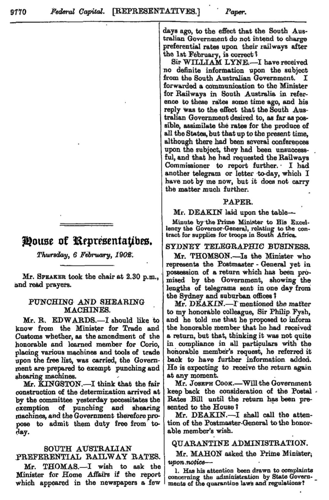

```{r, setup, include=FALSE}
knitr::opts_chunk$set(cache=TRUE)

library(here)
library(kableExtra)
library(knitr)
library(tidyverse)

elections <- read_csv(here::here("inputs/misc/misc_elections_data.csv"), col_types = cols())
governments <- read_csv(here::here("inputs/misc/change_of_pm.csv"), col_types = cols())
keyEvents <- read_csv(here::here("inputs/misc/key_events.csv"), col_types = cols())
significances <- read_csv(here::here("outputs/misc/significance.csv"), col_types = cols())
top_words <- read_csv2(here::here("outputs/results-topic_models_and_gammas/top_words_80.csv"), col_types = cols())
missing_days <- read_csv(here::here("outputs/misc/missing_dates.csv"), col_types = cols())
hansard_sources <- read_csv(here::here("outputs/misc/hansard_sources.csv"), col_types = cols())

elections_results <-
  read_csv(here::here("outputs/results-analysis_model/results-elections.csv"), col_types = cols()) %>%
    filter(Significant %in% c("Yes")) %>%
    select(-Significant)


governments_results <-
  read_csv(here::here("outputs/results-analysis_model/results-governments.csv"), col_types = cols()) %>%
    filter(Significant %in% c("Yes")) %>%
    select(-Party,-`Died in Office`,-Significant)

key_events_results <- read_csv(here::here("outputs/results-analysis_model/results-outliers.csv"), col_types = cols())
#breka

key_events_results_cols <-
  read_csv(here::here("outputs/results-analysis_model/results-outliers_in_columns.csv"), col_types = cols())
  
names(key_events_results_cols) <- c("Dates", "", "", "", "", "", "", "")

key_events_results_cols <- key_events_results_cols[7:8]

names(key_events_results_cols) <- c("Dates", "")
  
```

# Summary

## Approach

- Create a dataset of what was said in the Australian Federal Parliament from 1901 through to 2017 based on available public records. 
- Use a correlated topic model to reduce dimemsionality.
- Analyse the effect of various events using a Bayesian hierarchical Dirichlet model. 

<div class="notes">
Test
</div>

## Findings

- Changes in government tend be associated with topic changes even when the party in power does not change.
- Elections that do not result in a change in government are rarely associated with topic changes.
- The effect of events is much more pronounced in the second half of our sample, and especially in the past two decades.


# Data

## Hansard
- A daily text record called Hansard of what was said in the Australian Federal Parliament has been made available since it was established in 1901. It's not vertatim, but it's pretty close.
- Hansard records have been used in other counties but not really at scale in Australia.
- Daily PDFs are available online and these are considered the official release. 
- There are 14,551 days of publicly available Hansard records across both chambers of the Australian Federal Parliament.

## Example PDF page

```{r pressureFig, echo=FALSE, out.width = '75%', fig.align="center"}



```

## PDF parsing
- We use scripts written in R to convert the PDFs into daily text records.
- Some error is introduced at this stage:
    - because many of the records are in a two-column format that need to be separated; and 
    - the PDF parsing is not always accurate especially for older records e.g. 'the' is often parsed as 'thc'.
- We remove numbers and punctuation; change the words to lower case; and concatenate multi-word names titles and phrases, such as new zealand to new_zealand. Then the sentences are de-constructed and each word considered individually.


# Topic Model

## Latent Dirichlet Allocation - Overview

- Each document is assumed to be from a speaker who decides the topics they would like to talk about in that document, and then choose words, 'terms', that are appropriate to those topics. 
- A topic could be thought of as a collection of terms, and a document as a collection of topics, where these collections are defined by probability distributions. 
- The topics are not specified *ex ante*; they are an outcome of the method -- this is an unsupervised machine learning method.


## Latent Dirichlet Allocation - Topic distribution for documents

```{r topicsoverdocuments, cache = TRUE, echo=FALSE}

tibble(
  Topics = rep(c("1", "2", "3", "4", "5"), 2),
  Probability = c(c(0.40, 0.40, 0.1, 0.05, 0.05), c(0.01, 0.04, 0.35, 0.20, 0.4)),
  Document = c(rep("Document 1", 5), rep("Document 2", 5))
  ) %>%
  ggplot(aes(Topics, Probability, colour = Document)) +
  geom_point(size = 4) +
  theme_classic() +
  coord_flip()  +
  scale_colour_viridis_d() +
      theme(text = element_text(size = 20)) +
    theme(
    panel.background = element_rect(fill = "transparent") # bg of the panel
    , plot.background = element_rect(fill = "transparent", color = NA) # bg of the plot
    , panel.grid.major = element_blank() # get rid of major grid
    , panel.grid.minor = element_blank() # get rid of minor grid
    , legend.background = element_rect(fill = "transparent") # get rid of legend bg
    , legend.box.background = element_rect(fill = "transparent") # get rid of legend panel bg
  )


```

<!-- Statistically, LDA considers each document as having been generated by some probability distribution over topics. Similarly, each topic is considered a probability distribution over terms. To choose the terms used in each document, terms are picked from each topic in the appropriate proportion.  -->


## Latent Dirichlet Allocation - Term distribution over topics

```{r topicsoverterms, cache = TRUE, echo=FALSE}

tibble(
  Terms = rep(c("migration", "race", "influx", "loans", "wealth", "saving", "chinese", "france", "british", "english"), 2),
  Probability = c(c(0.0083, 0.0083, 0.0083, 0.0083, 0.0083, 0.0083, 0.2, 0.15, 0.4, 0.2), c(0.0142, 0.0142, 0.0142, 0.25, 0.35, 0.30, 0.0142, 0.0142, 0.0142, 0.0142)),
  Topics = c(rep("Topic 1", 10), rep("Topic 2", 10))
  ) %>%
  ggplot(aes(Terms, Probability, colour = Topics)) +
  geom_point(size = 4) +
  theme_classic() +
  coord_flip() +
  scale_colour_viridis_d() +
    theme(text = element_text(size = 20)) +
  theme(
    panel.background = element_rect(fill = "transparent") # bg of the panel
    , plot.background = element_rect(fill = "transparent", color = NA) # bg of the plot
    , panel.grid.major = element_blank() # get rid of major grid
    , panel.grid.minor = element_blank() # get rid of minor grid
    , legend.background = element_rect(fill = "transparent") # get rid of legend bg
    , legend.box.background = element_rect(fill = "transparent") # get rid of legend panel bg
  )

```


## Correlated Topic Model
Modification of LDA - rather than assuming that the distribution of topics in a document, $\theta_d$, are a draw from a Dirichlet distribution, as in LDA, CTM assumes
$$\theta_d \sim \mbox{Logistic Normal}(\mu, \Sigma)$$
Essentially it swaps the Dirichlet for the Logistic Multivariate Normal. This sounds easy, but it's hard to implement.

## Correlated Topic Model - Example output

```{r exampletopics, echo=FALSE, out.width = '100%'}

```


## Structural Topic Model
The Structural Topic Model approach then adds a covariate to $\mu$ which allows consideration of additional information. 
$$\theta_d|X_d\gamma\Sigma \sim \mbox{Logistic Normal}(\mu = X_d\gamma, \Sigma)$$
Again, sounds easy, but hard to implement, and they have a very nice algorithm.


## Why not use STM?
STM is great, but it is specific to various contexts and ours is slightly outside them:

- No way to specify more complicated auto-correlated functional forms of the effects of events over time. 
- There is no way to implement partial pooling across groups of similar documents. 
- There is no way of identifying 'outlying' topic distributions -- and therefore events that had an important effect -- without pre-specifying the event of interest in the model.
In an ideal world we could modify the STM code, but instead we build a similar, but different, analysis model.

<!-- Also you don't really understand something until you code it yourself. -->


# Analysis model

## Analysis model - Overview
- We use the estimated topic distributions from the CTM described in the previous section as an input into a Bayesian hierarchical Dirichlet regression framework.
- This relates the proportions of each topic to underlying time trends, changes in governments and elections. 
- This set-up also allows us to identify 'outlying' topic distributions and relate these to other events. 

## Analysis model - Set-up
- Define $\theta_{dp}$ to be the proportion of topic of topic $p$ on day $d$. Note that the $\theta_{d,1:P}$ for $p = 1,2,\dots P=40$ are equal to the estimated values of $\theta_d$ from the CTM. 
- We assume that the majority of variation in topics is across sitting periods $s$, where a sitting period is defined as any group of days that are less than one week apart. Using this definition, there are a total of 745 sitting periods over the period 1901 to 2017 inclusive.

## Analysis model - Daily distribution
The topic proportions on day $d$ are modelled in reference to their membership of a particular sitting period $s$. Firstly, we assume that each distribution of topics, $\theta_{d,1:P}$ for each day is a draw from a Dirichlet distribution with mean parameter $\mu_{s[d],1:P}$:
$$
\theta_{d,1:P} \sim \mbox{Dirichlet}(\mu_{s[d],1:P})
$$

<!-- where the notation $s[d]$ refers to the sitting period $s$ to which day $d$ belongs. This distributional assumption accounts for the fact that on any given day, the sum of all proportions in each topic must equal 1.  -->

The goal of the model is to relate these proportions to government $g$ at time $d$, and also the days since the most recent election, $e$, while account for underlying time trends. 


## Analysis model - Mean parameters

The mean parameters $\mu_{s,p}$ are modelled on the log scale as:
$$
\log \mu_{s,p} = \alpha_{g[s],p} + \cdot\alpha_{e[s],d,p}  + \sum_{k=1}^{K} \beta_{p,k} \cdot x_{s,k} + \delta_{s,p}
$$

- $\alpha_{g[s],p}$ is the mean effect for government $g$ (which covers sitting period $s$) and topic $p$;
- $\alpha_{e[s],d,p}$ is the effect of election $e$ (which occurs in sitting period $s$) for topic $p$ on day $d$ since the election;
- $\sum_{k=1}^{K} \beta_{p,k} \cdot x_{s,k}$ is the underlying time trend, modelled using splines: $x_{s,k}$ is the $k$th basis spline in sitting period $s$ and $\beta_{p,k}$ is a coefficient on the $k$th basis spline; and
- $\delta_{s,p}$ is a structured random, or levels, effect for each sitting period and topic. 

## Analysis model - Government effects

The government term $\alpha_{g[s],p}$ assumes there is some underlying mean effect of each government on the topic distribution. We place uninformative priors on each of these parameters: $\alpha_{g[s],p} \sim \mbox{Normal}(0, 100)$

## Analysis model - Election effects

The election term $\alpha_{e[s],d,p}$ assumes there is an initial effect of an election on the topic distribution, which then decays as a function of days since election, $d$. In particular, we model this as an AR(1) in $d$:
$$
\alpha_{e[s],d,p} = \rho_{e[s],p} \cdot \alpha_{e[s],d-1,p}
$$

We use non-informative priors.

<!-- One advantage of our model over using the STM is that we can restrict the effect of an election to be monotonically decreasing. This allows us to identify differences between government and election effects even when there is a one-term government. We use non-informative priors. -->


## Analysis model - Time effects

We model the underlying time trend in topics using splines regression. The intuition behind this term is to capture the underlying non-linear trend in topic distributions over time, which is caused by large-scale structural changes in the economy, and Australian society and culture. The $x_{s,k}$ for $k = 1,2,\dots, K$ are the value of cubic basis splines for sitting period $s$ at knot point $k$. We place knot points every five sitting periods as this is the average length of time for a government to sit. 

<!-- Non-informative priors are placed on the splines coefficients: -->
<!-- $$ -->
<!-- \beta_{p,k} \sim \mbox{Normal}(0, 100) -->
<!-- $$ -->


## Analysis model - Sitting period effects

<!-- This allows us to identify large deviations away from the expected distribution, thus helping to identify the effect of other, non-government and non-election events. In addition, this set up also partially pools effects across sitting periods.  -->

The sitting period-specific random effect $\delta_{s,p}$ allows the topic distributions in some sitting periods to be different than expected based on government and election effects:
$$
\delta_{s,p} \sim \mbox{Normal}(0, \sigma_{e[s],p}^2)
$$

The variance parameters $\sigma_{e[s],p}^2$ give an indication of the how the variation in topics is changing over election periods. If the estimates of the variance are larger, then there is more variation in the topics discussed within an election period. Non-informative priors are placed on the variance parameters:
$$
\sigma_{e[s],p} \sim \mbox{Uniform}(0,3)
$$

We run the model in JAGS using the \texttt{rjags} package.


# Results


## Topic modelling

<!-- We applied the CTM approach discussed in Section 3.2 on the processed Hansard text database outlined in Section 2. The main output of interest are the types of topics identified by the model, and the prevalence of each topic on of each day of parliamentary discussion.  -->

<!-- The remainder of the results refer to a topic model that had 40 distinct topics defined. The choice of 40 topics was made as a trade-off between semantic coherence and exclusivity with 40 topics performing better on both measures than 20. Measures such as residuals and held-out likelihood suggest a larger number of topics would be more appropriate. -->

<!-- Table \@ref(tab:topwords) lists the top five words associated with each of the forty topics. The topics cover areas such as budgets, transport and infrastructure, war and conflict, health, education, agriculture, and trade. Note that some topics seem to somewhat overlap with their content: for example, topics 12, 17, 22 and 23 all relate to war and conflict.  -->

We choose 80 topics because it is the minimum needed to have meaningful results.

```{r topwords, echo = FALSE, results = 'asis'}
# library(tidyverse)
# # top_words <- read_csv2(here::here("outputs/misc/top_words_40.csv"), col_types = cols())
# library(kableExtra)

top_words %>%
  filter(topic %in% c(2, 4, 6, 8, 10, 12)) %>% 
  kable() 

```


## Analysis model - Estimates by sitting period

<!-- There are several outputs of interest from this modelling stage. For example, the model provides estimates of topic prevalence by each sitting period. This nicely illustrates how the topics change over time, as the daily estimates tend to be quite variable, but using periods defined by governments or elections tend not to provide enough variability. For instance, examining Topics 12, 17, 22 and 23, which have to do with war and conflict illustrates Australia's involvement in World War I, World War II, the Korean War, the Vietnam War, the first Gulf War, and the war in Afghanistan and the second Gulf War (Figure \@ref(fig:wartopicsgraph)). -->

```{r wartopicsgraph, cache = TRUE, echo = FALSE, out.width = '100%', fig.align="center"}
knitr::include_graphics("../../../figures/war_stack-slides.pdf")
```


<!-- One of the main goals of the analysis model is to see which political events are associated with changes in the prevalence of topics over time. Political events are those related to a change of government or an election. As Australia has a parliamentary system, it is possible for the government to change without an election. We define a government based on who is the prime minister, and do not distinguish between terms or cabinet composition as is sometimes done. If a person was prime minister more than once then these are considered separately.  -->

<!-- As detailed in Section 3.3, the model estimates a mean level effect for each government, $\alpha_g$ and each election, $\alpha_e$. We identify differences between neighbouring governments and between neighbouring elections based on calculating 95 per cent credible intervals based on posterior samples of these respective mean effects. When these do not overlap we consider that the model finds a significant difference between either the neighbouring governments or elections.  -->

<!-- We summarise our results in terms of governments in Table \@ref(tab:governmentsresults) and in terms of elections in Table \@ref(tab:electionsresults). These tables focus on elections and governments that were different to the ones that preceded them.  -->

## Analysis model - Significantly different elections

```{r electionsresults, echo = FALSE, results = 'asis'}

elections_results %>%
  filter(Number %in% c(9, 10, 19, 21, 22, 23, 28, 30, 32, 33)) %>% 
  kable() %>%
  kable_styling(font_size = 10)

```

## Analysis model - Significantly different elections (cont.)

```{r electionsresultscont, echo = FALSE, results = 'asis'}

elections_results %>%
  filter(Number %in% c(34, 35, 36, 38, 39, 40, 41, 42, 43, 44)) %>% 
  kable() %>%
  kable_styling(font_size = 10)

```


## Analysis model - Significantly different governments

```{r governmentsresults, echo = FALSE, results = 'asis'}

governments_results %>%
  filter(Number %in% c(6, 9, 10, 12, 14, 15, 16, 20, 21, 22)) %>% 
  kable() %>%
  kable_styling(font_size = 10)

```


## Analysis model - Significantly different governments (cont.)

```{r governmentsresultscont, echo = FALSE, results = 'asis'}

governments_results %>%
  filter(Number %in% c(24, 25, 26, 27, 28, 29, 30, 31, 32, 34)) %>% 
  kable() %>%
  kable_styling(font_size = 10)

```

## Analysis model - All governments

<!-- In Figures \@ref(fig:mugov) and \@ref(fig:muelection) we focus on certain topics to illustrate differences between governments and elections, respectively. In the graphs, the points show the estimated value of $\alpha_g$ and $\alpha_e$, respectively, for each of the topics specified. The error bars represent 95 per cent Bayesian credible intervals. The topics that we have focused on here are: -->
<!-- 12, 17, 22, 23 which have to do with conflict, defence and security; 13 and 32 which have to do with commerce and trade; 24 and 33 which have to do with the budget, tax and spending; 29 which is to do with education and 39 which has to do with health. -->


```{r mugov, cache = TRUE, echo = FALSE, out.width = '100%', fig.align="center"}
knitr::include_graphics("../../../figures/mu_gov-slides.pdf")
```


## Analysis model - All elections

```{r muelection, cache = TRUE, echo = FALSE, out.width = '100%', fig.align="center"}
knitr::include_graphics("../../../figures/mu_election-slides.pdf")
```


## Analysis model - Events
<!-- Although we do not explicitly include them in the model, the non-political events that we look for when considering periods of significant change are defined by substantial changes in various economic measures, such as the onset of the Great Depression or floating the currency; events of a historical magnitude, such as entering into a war or the 9/11 attacks; or events that had a significant effect on Australian life, such as hosting the Olympics, or the Mabo decision. The full list of events that we consider are detailed in Appendix \@ref(eventdetails). Note that we consider each chamber separately and future work could expand the model to better understand, and allow, for correlation between them. -->

<!-- We estimate sitting-period level-effects (essentially a mean for each topic by sitting period). The difference between this mean distribution and a particular day's topic distribution defines a measure that can be thought of as essentially a residual which allows us to identify outlying days. This approach means that the model generates dates that are interesting without us having to specify interesting dates.  -->

<!-- More specifically, we define a day to be 'outlying' or 'different-to-expected' if the topic distribution on that particular day is more than three standard deviations different to the mean topic distribution for the relevant sitting period. Table \@ref(tab:keyeventsresultstable) summarises the days where parliamentary discussion was significantly different from the rest prevailing in that week. -->

```{r keyeventsresultstable, echo = FALSE, results = 'asis'}

key_events_results_cols %>%
  kable() %>%
  kable_styling(font_size = 10)

```


<!-- Finally, Figure \@ref(fig:sigmaelection) illustrates the estimated standard deviation of topic distributions, around the mean election effect, over time. In general, the estimates of standard deviation are increasing over time, suggesting that discussed topics are more variable in more recent election periods compared to historical periods.  -->

<!-- ```{r sigmaelection, cache = TRUE, echo = FALSE, fig.cap = "Elections level effects on selected topics", out.width = '100%'} -->
<!-- knitr::include_graphics("../../figures/sigma.pdf") -->
<!-- ``` -->


## Menzies-Holt

<!-- Of the 36 different governments over this period, we find that 14 of them are significantly different to the government that preceded them. However, two of these results -- the significance of the Page  Government and the first Menzies Government -- are likely due to the short length of the Page Government and should be ignored, leaving only 12. The earliest of these are the Second and Third Fisher Governments, which were different to the Third Deakin Government and the Cook Government respectively. To a certain extent this is likely tied up with changes due to World War I. -->

<!-- The Second Menzies Government, starting in 1949, is the next government that is significantly different to a predecessor. The rest of the ones that are different are concentrated in the second half of our sample, with three of them being in the past twenty years. Similarly, of the 45 general elections that have been held we find that 14 of them define periods that were significantly different to their immediate predecessor. 1974, 1980, 1990, 1998, 2004, and 2007 stand out as elections where the government did not change, but the model suggests there was considerable change in the topics discussed in parliament. -->

<!-- The second Menzies Government was associated with a variety of changes compared with the preceding Chifley Government. The Chifley Government had governed through the end of World War II and the difficult economic times that followed. There was also a large increase in the number of seats in the House of Representatives at the 1949 election. Many new politicians entered parliament and this changed representation may also have been partly to do with the changed distribution of discussion topics. The sixteen-year length of the second Menzies Government, and better economic conditions over this time make it understandable why parliamentary discussion would have been different.  -->

<!-- There were six elections within the second Menzies Government. However we do not find that any of those elections was associated with a significant change in the topics discussed. In this sense it was a period of consistency, especially when compared with shorter-term Whitlam Government, or the longer-term Howard Government.  -->

<!-- The Menzies Government was succeeded by the Holt Government in January 1966. This is an example where there was a change in government without an election, as the next election only happened in November 1966. We find that the Holt Government is significantly different to the Menzies Government. In Figures \@ref(fig:muelectionall) we compare the topics during the final term of the Menzies Government with the topics of the Holt Government. -->

```{r muelectionmenziesholt, cache = TRUE, echo = FALSE, out.width = '100%', fig.align="center"}
knitr::include_graphics("../../../figures/mu_election-differences-menziesholt-slides.pdf")
```


## Whitlam re-election

```{r muelectionwhitlam, cache = TRUE, echo = FALSE, out.width = '100%', fig.align="center"}
knitr::include_graphics("../../../figures/mu_election-differences-whitlam-slides.pdf")
```


<!-- The Whitlam government is interesting as we find a difference in the topics after it was first elected in December 1972, compared with its second election win in May 1974. Figure \@ref(fig:muelectionall) compares the topics that are significant in the first Whitlam term and then compares them to those in the second Whitlam government. -->

## Howard instability

```{r muelectionhoward, cache = TRUE, echo = FALSE, out.width = '100%', fig.align="center"}
knitr::include_graphics("../../../figures/mu_election-differences-howard-slides.pdf")
```


<!-- The Howard Government is interesting because of the significant differences between elections. For instance, each of the election periods is associated with fairly substantial differences compared with the preceding election periods, and all apart from 2001 are actually significantly different at the 95 per cent level. Figure \@ref(fig:muelectionall) compares the topics that are significant in the different Howard terms. -->

<!-- To a certain extent the change after the November 2001 election is expected because of the 9/11 terrorist attacks that had only occurred two months earlier, the Bali Bombings that occurred in October 2002, and the dramatic increase in the discussion related to terrorism and conflict over these years. However the change in 1998 and 2004 is more unexpected. Although the Howard Government is the second-longest serving government and commonly thought of as a period of stability because the senior ministers were consistent as well, it might be that it is better to think of the Howard Government as a combination of three or four different periods and that the Howard Government reinvented itself over this period. -->

<!-- One advantage of our analysis model, compared with using the STM approach is that we can create a measure that is equivalent to testing for outliers in a model where the underlying variables were not latent. The results of this reduction in supervision are promising, but suggest specifics of our process need further refinement. For instance, our approach appropriately identifies the sitting day that first follows 11 September 2001 and 12 October 2002, which were the dates of the 9/11 Attacks and Bali Bombings respectively. It also appropriately identifies some of other key events that we were interested in. However there are many dates that we would have expected to be identified that were not, and similarly some of the dates that were identified are surprising. Further work is needed to improve this approach. For instance, our approach may not be appropriately considering step-changes. -->


# Issues/tradeoffs

## Issues/tradeoffs
- Even after cleaning the dataset remains imperfect and is more fit-for-purpose than of broad applicability.
- Topic interpretation is difficult. 
- Inputs have to be fine-tuned.
- Assuming government effects are is constant across the whole period. 
- Assuming the effect of elections is monotonically decreasing across days since election. 
- Identification of unusual periods could also be improved. 
- Propogation of uncertainty is inappropriate.


# Current/future work

## Current/future work
<!-- ### Improve data -->
<!-- - Trying to get website data instead of needing to parse PDFs. -->

### Current work
- In-group and out-group identity: which is more important?
- Senate/HoR: just how different are they?
- Methods assessment: how is your cleaning impacting your results?
- States/Commonwealth: where does policy come from?

### Future
- Open to suggestions and keen for collaboration.

## Questions?
- rohan.alexander@anu.edu.au
- @RohanAlexander
- rohanalexander.com

```{r hansardphoto, echo=FALSE, out.width = '75%', fig.align="center"}


```


# Supplementary

## Latent Dirichlet Allocation - Data generation process

1. There are $K$ topics and the vocabulary consists of $V$ terms. For each topic, decide the terms by randomly drawing distributions over the terms. The distribution over the terms for the $k$th topic is $\beta_k$. Use the Dirichlet distribution with hyper-parameter $\boldsymbol{\eta}$: $\beta_k \sim \mbox{Dirichlet}(\boldsymbol{\eta})$, where $\boldsymbol{\eta} = (\eta_1, \eta_2, \dots, \eta_{K})$.

## Latent Dirichlet Allocation - Data generation process (cont.)

2. Decide the topics that each document will cover by randomly drawing distributions over the $K$ topics for each of the $D$ documents. The topic distributions for the $d$th document are $\theta_d$, and $\theta_{d,k}$ is the topic distribution for topic $k$ in document $d$. Again, the Dirichlet distribution with the hyper-parameter $0<\alpha<1$ is used here because usually a document would only cover a handful of topics: $\theta_d \sim \mbox{Dirichlet}(\boldsymbol{\alpha})$.

## Latent Dirichlet Allocation - Data generation process (cont.)
3. If there are $N$ terms in the $d$th document, then to choose the $n$th term, $w_{d, n}$:
    a. Randomly choose a topic for that term $n$, in that document $d$, $z_{d,n}$, from the multinomial distribution over topics in that document, $z_{d,n} \sim \mbox{Multinomial}(\theta_d)$.
    b. Randomly choose a term from the relevant multinomial distribution over the terms for that topic, $w_{d,n} \sim \mbox{Multinomial}(\beta_{z_{d,n}})$.

## Latent Dirichlet Allocation - Data generation process (cont.)
Given this set-up, we have a joint distribution for the variables and the analysis problem, discussed next, is to compute a posterior over $\beta_{1:K}$ and $\theta_{1:D}$, given $w_{1:D, 1:N}$. This is intractable directly, but can be approximated.


## Latent Dirichlet Allocation - Analysis problem
- After the documents are created, they are all that we have to analyse. The term usage in each document, $w_{1:D, 1:N}$, is observed, but the topics are hidden, or 'latent'. 
- We do not know the topics of each document, nor how terms defined the topics. In a sense we are trying to reverse the document generation process.
- If the earlier process around how the documents were generated is assumed and we observe the terms in each document, then we can obtain estimates of the topics. 

## Latent Dirichlet Allocation - Analysis problem (cont.)
- The outcomes of the LDA process are probability distributions and these define the topics. Each term will be given a probability of being a member of a particular topic, and each document will be given a probability of being about a particular topic. 
- That is, we are trying to calculate the posterior distribution of the topics given the terms observed in each document.
- The choice of the number of topics, *k*, drives the results and must be specified *a priori*. 

<!-- If there is a strong reason for a particular number, then this can be used. Otherwise, one way to choose an appropriate number is to use cross validation. -->

<!-- One weakness of the LDA method is that it considers a 'bag of words' where the order of those words does not matter. It is possible to extend the model to reduce the impact of the bag-of-words assumption and add conditionality to word order. Additionally, alternatives to the Dirichlet distribution can be used to extend the model to allow for correlation. This is the Correlated Topic Model, described in the next section. -->